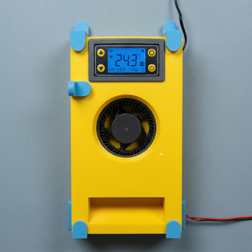

# Sinilink XY-WFTX — Home Assistant integration

<p align="center">
  
</p>

Local monitoring and control of the Sinilink XY-WFTX WiFi thermostat. No cloud dependency, no firmware flashing.

## Reference hardware

Built and verified against the **D3D Store "Chamber Heater for Bambu Lab P1S / X1C / P1P"** kit:

**[AliExpress listing](https://www.aliexpress.com/item/1005007451846333.html)**

The kit bundles a PTC heating element with the Sinilink XY-WFTX WiFi thermostat controller (ESP8285, 10A relay, NTC + DS18B20 inputs). Other kits using the same XY-WFTX module should also work but are unverified.

## Features (v0.3)

### Entities

| Entity | Type | Read | Write (requires MQTT) |
|---|---|---|---|
| Thermostat | `climate` | Current temp, start/stop band, hvac action | Set start/stop temps, HVAC mode heat/off |
| Temperature | `sensor` | Current measured temperature | — |
| E-stop | `binary_sensor` | Problem when e-stop is tripped | — |
| E-stop | `switch` | Arm/disarm state | Arm / disarm e-stop |
| Relay | `switch` | On/off state | Direct relay control |
| LED | `switch` | On/off state | Toggle device LED |
| Notifications | `switch` | On/off state | Toggle cloud push notifications |
| Temperature alarm | `binary_sensor` | Problem when temp is outside alarm thresholds | — |

### Read path (UDP, always available)

Polls the device every 10s via `SINILINK521` on UDP/1024. Works out of the box with no infrastructure. Reflects changes made from the physical buttons or the official Sinilink app.

### Write path (MQTT, requires local broker)

Publishes commands to the device via a local MQTT broker. The device firmware connects to `mq.sinilink.com:1884` for MQTT — by DNS-overriding that hostname to a local Mosquitto instance, the integration gains full write control without modifying the device.

**Infrastructure required for writes:**
1. A standalone Mosquitto broker on your LAN (port 1884, `allow_anonymous true`)
2. A DNS override (Pi-hole / router) pointing `mq.sinilink.com` to the broker's IP
3. Power-cycle the device so it connects to the local broker

Without MQTT configured, the integration runs in read-only mode.

## Install

### Option 1 — HACS (recommended)

1. HACS -> **Integrations** -> top-right menu -> **Custom repositories**.
2. Add `https://github.com/warfuric/ha-sinilink-udp` as category **Integration**.
3. Install **Sinilink XY-WFTX**, restart Home Assistant.

### Option 2 — Samba (HAOS)

1. Enable the **Samba share** addon.
2. Mount `\\<HA-IP>\config` (e.g. `smb://homeassistant.local`).
3. Copy `custom_components/sinilink_udp/` into `config/custom_components/`.
4. **Settings -> System -> Restart**.

### Option 3 — SSH (dev / CI)

```bash
cp .env.example .env   # first time only -- fill in HA_HOST
./scripts/deploy.sh
```

## Setup

### Step 1: Add the device

Settings -> Devices & Services -> **Add Integration** -> "Sinilink XY-WFTX"

- **Scan network** — broadcasts `SINILINK521` on UDP/1024, lists discovered devices.
- **Manual entry** — enter the device's IP and MAC, validated by sending a discovery packet.

### Step 2: Configure MQTT (optional)

The config flow asks for the MQTT broker address. Enter the host and port of your local Mosquitto instance (default port `1884`). Leave blank to skip and run in read-only mode.

You can add or change the MQTT broker later via the integration's options.

## Verifying the device speaks the protocol

```bash
python3 -c "import socket; s=socket.socket(socket.AF_INET, socket.SOCK_DGRAM); s.settimeout(3); s.sendto(b'SINILINK521', ('DEVICE_IP_HERE', 1024)); print(s.recv(2048))"
```

You should see a JSON response with a `param` array. If the indices differ from the table below, edit `const.py`.

## Param array index map

| Index | Field | MQTT command | Notes |
|---:|---|---|---|
| 0 | Relay | `relay` (`"open"`/`"close"`) | |
| 1 | Mode | `oprate` (`"A"`/`"M"`) | |
| 3 | Current temp | — | Read-only |
| 4 | Unit | `unit` (`"C"`/`"F"`) | |
| 5 | Heat/Cool | — | "H" or "C" |
| 6 | Start temp | `stemp` (number) | Heater ON below this |
| 7 | Stop temp | `btemp` (number) | Heater OFF above this |
| 9 | Delay timer | `delay` (seconds) | |
| 10 | High alarm enabled | — | 1 = armed |
| 11 | High alarm threshold | `otp` (number) | Buzzer alarm |
| 12 | Low alarm enabled | — | 1 = armed |
| 13 | Low alarm threshold | `ltp` (number) | Buzzer alarm |
| 18 | E-stop | `stop` (`1`/`0`) | 1 = armed |
| 19 | Delay enabled | `sw_dly` (`1`/`0`) | |
| 20 | Notifications | `wechat` (`"1"`/`"0"`) | Cloud push |
| 21 | LED | `led` (`"0"`/`"1"`) | **Inverted**: 0=on, 1=off |
| 22 | Modbus baud | — | Read-only (115200) |
| 23 | Modbus slave | — | Read-only (1) |

## MQTT protocol summary

The device connects to `mq.sinilink.com:1884` (raw MQTT, anonymous).

| Topic | Direction | Purpose |
|---|---|---|
| `PROWT{MAC}` | Device -> Broker | Status every ~30s (same JSON as UDP) |
| `APPWT{MAC}` | App/HA -> Device | Commands |
| `returnisonline{MAC}` | Device -> Broker | Online/offline (retained) |

Command format: `{"method":"<name>","param":<value>,"time":<epoch>}`

The device's encrypted config at `www.sinilink.com/siniconfig/default.json` (AES-128-CBC, key `0123456789abcdef`) specifies the broker address and port.

## Setting up the local MQTT broker

Minimal `mosquitto.conf`:

```
listener 1884
allow_anonymous true

listener 8085
protocol websockets
allow_anonymous true
```

Port 1884 serves the device (raw MQTT). Port 8085 serves the official Sinilink app (WebSocket MQTT) if you want to keep the app functional alongside HA.

Add a DNS override in Pi-hole / your router: `mq.sinilink.com` -> `<broker IP>`. Power-cycle the device to force a fresh DNS lookup.

## Acknowledgements

- **[9lyph/CVE-2022-43704](https://github.com/9lyph/CVE-2022-43704)** -- original security research disclosing the UDP/1024 endpoint and `SINILINK521` discovery string. The parser in `protocol.py` is structurally inspired by their PoC, adapted after the `param` layout turned out to differ.
- **[Tasmota XY-WFT1 template](https://templates.blakadder.com/sinilink_XY-WFT1.html)** -- GPIO pinout reference for the ESPHome alternative path.
